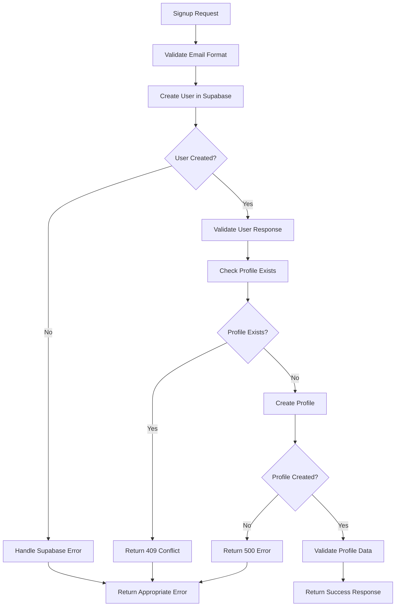

# Signup Function Rewrite - One-to-One Relationship Implementation

## Overview

The FastAPI signup function has been completely rewritten to ensure proper one-to-one relationship between `auth.users` and `profiles` tables, with comprehensive error handling and validation.

## Database Schema

The `profiles` table is designed with a foreign key constraint that enforces the one-to-one relationship:

```sql
create table public.profiles (
  id uuid not null,
  avatar_url text null,
  account_type public.account_type_enum null default 'personal'::account_type_enum,
  created_at timestamp with time zone not null default now(),
  updated_at timestamp with time zone null,
  first_name text not null,
  last_name text not null,
  phone_number text null,
  constraint profiles_pkey primary key (id),
  constraint profiles_id_fkey foreign KEY (id) references auth.users (id) on update CASCADE on delete CASCADE,
  -- ... other constraints
);
```

**Key Points:**
- `id` is both primary key and foreign key referencing `auth.users(id)`
- `ON DELETE CASCADE` ensures profile is deleted when user is deleted
- `ON UPDATE CASCADE` ensures profile ID updates when user ID changes
- This enforces a strict one-to-one relationship

## Rewritten Signup Function Features

### 1. Email Uniqueness Validation

**Before Supabase Call:**
- Uses Supabase's built-in duplicate detection
- Handles `422` status with "already registered" error
- Returns clear `HTTP 409` conflict error

**Error Response:**
```json
{
  "message": "Email already registered",
  "error": "A user with email 'user@example.com' already exists. Please use a different email or try signing in instead.",
  "email": "user@example.com"
}
```

### 2. User Creation in Supabase

**Process:**
1. Attempts to create user in `auth.users` table
2. Validates response contains required fields (`id`, `email`, `created_at`)
3. Handles Supabase-specific errors appropriately

**Error Handling:**
- `400` with "email_address_invalid" → Email validation failed
- `422` with "already registered" → User already exists
- Missing user ID → Internal server error

### 3. Profile Creation with One-to-One Relationship

**Process:**
1. Checks if profile already exists for the user_id (additional safety)
2. Creates profile with same `user_id` as Supabase user
3. Sets default values for required fields
4. Validates profile creation success

**Default Values:**
- `first_name`: "User" (if not provided)
- `last_name`: "User" (if not provided)
- `account_type`: `PERSONAL` (default enum value)
- `phone_number`: `null` (if not provided)

### 4. Comprehensive Validation

**User Data Validation:**
- Required fields: `id`, `email`, `created_at`
- Missing fields trigger `HTTP 500` error

**Profile Data Validation:**
- Required fields: `id`, `first_name`, `last_name`, `account_type`
- Missing fields trigger `HTTP 500` error
- Profile creation failure triggers `HTTP 500` error

### 5. Error Handling Strategy

**Exception Hierarchy:**
1. **HTTPException** → Re-raised (already properly formatted)
2. **Profile Creation Failure** → `HTTP 500` with specific error message
3. **Unexpected Errors** → `HTTP 500` with generic error message

**Error Response Format:**
```json
{
  "detail": "Profile creation failed: [specific error message]"
}
```

## Function Flow



## Response Format

### Successful Signup Response:
```json
{
  "message": "User and profile created successfully",
  "user": {
    "id": "uuid",
    "email": "user@example.com",
    "created_at": "2024-01-01T00:00:00Z",
    "aud": "authenticated",
    "role": "authenticated"
  },
  "profile": {
    "id": "uuid",
    "first_name": "John",
    "last_name": "Doe",
    "phone_number": "0509556183",
    "account_type": "personal",
    "created_at": "2024-01-01T00:00:00Z"
  },
  "profile_created": true,
  "profile_message": "Profile created successfully"
}
```

### Error Responses:

**Email Already Registered (409):**
```json
{
  "message": "Email already registered",
  "error": "A user with email 'user@example.com' already exists. Please use a different email or try signing in instead.",
  "email": "user@example.com"
}
```

**Email Validation Failed (400):**
```json
{
  "message": "Email validation failed",
  "error": "The email address format is valid but not accepted by the authentication service. Please try a different email address.",
  "email": "user@example.com"
}
```

**Profile Creation Failed (500):**
```json
{
  "detail": "Profile creation failed: [specific error message]"
}
```

## Key Improvements

### 1. **Clean Architecture**
- Removed redundant validation logic
- Clear separation of concerns
- Proper error handling hierarchy

### 2. **One-to-One Relationship Enforcement**
- Database-level foreign key constraint
- Application-level duplicate checking
- Consistent user_id across both tables

### 3. **Comprehensive Error Handling**
- Specific error messages for different failure scenarios
- Proper HTTP status codes
- Detailed validation feedback

### 4. **Production-Ready Code**
- Async/await patterns
- Proper exception handling
- Type hints and documentation
- Clean, readable code structure

### 5. **Data Integrity**
- Validates all required fields
- Sets appropriate default values
- Ensures profile creation succeeds or fails atomically

## Database Constraints

The database schema enforces data integrity through:

1. **Foreign Key Constraint**: `profiles.id` → `auth.users.id`
2. **CASCADE Operations**: Automatic cleanup on user deletion/update
3. **Check Constraints**: Field length and format validation
4. **Indexes**: Optimized queries for common operations

## Testing Scenarios

### Valid Signup:
```bash
POST /api/v1/supabase-auth/signup
{
  "email": "newuser@example.com",
  "password": "SecurePass123!",
  "first_name": "John",
  "last_name": "Doe",
  "phone_number": "0509556183"
}
```

### Duplicate Email:
```bash
POST /api/v1/supabase-auth/signup
{
  "email": "existing@example.com",  # Already exists
  "password": "SecurePass123!",
  "first_name": "Jane",
  "last_name": "Smith",
  "phone_number": "0509556184"
}
# Returns: 409 Conflict
```

### Invalid Email:
```bash
POST /api/v1/supabase-auth/signup
{
  "email": "invalid-email",
  "password": "SecurePass123!",
  "first_name": "Test",
  "last_name": "User"
}
# Returns: 400 Bad Request (Pydantic validation)
```

## Implementation Files

- `app/routes/supabase_auth_router.py` - Main signup endpoint
- `app/services/profile_service.py` - Profile operations
- `app/schemas/profile.py` - Profile data models
- `app/models/profile.py` - SQLAlchemy profile model
- `docs/SIGNUP_FUNCTION_REWRITE.md` - This documentation

## Status Codes

- `200` - Successful signup
- `400` - Email validation failed
- `409` - Email already registered
- `422` - Supabase validation error
- `500` - Internal server error

The rewritten signup function ensures a robust, production-ready implementation with proper one-to-one relationship enforcement between auth.users and profiles tables.
