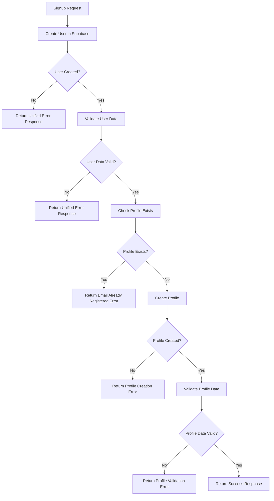

# Unified Response Structure Implementation

## Overview

The FastAPI signup function has been completely rewritten to enforce a one-to-one relationship between `auth.users` and `profiles` tables while implementing a unified JSON response structure for all scenarios.

## Unified Response Schema

### Base Response Structure

```python
class ErrorDetail(BaseModel):
    field: Optional[str] = None
    message: str

class UnifiedResponse(BaseModel):
    success: bool
    message: str
    data: Optional[Dict[str, Any]] = None
    errors: List[ErrorDetail] = Field(default_factory=list)
```

### Response Structure

All responses follow this consistent format:

```json
{
  "success": boolean,
  "message": "string",
  "data": object | null,
  "errors": [
    {
      "field": "string | null",
      "message": "string"
    }
  ]
}
```

## Response Examples

### 1. Successful Signup (HTTP 200)

```json
{
  "success": true,
  "message": "User and profile created successfully",
  "data": {
    "user": {
      "id": "uuid",
      "email": "user@example.com",
      "created_at": "2024-01-01T00:00:00Z",
      "aud": "authenticated",
      "role": "authenticated"
    },
    "profile": {
      "id": "uuid",
      "first_name": "John",
      "last_name": "Doe",
      "phone_number": "0509556183",
      "account_type": "personal",
      "created_at": "2024-01-01T00:00:00Z"
    }
  },
  "errors": []
}
```

### 2. Email Already Registered (HTTP 200)

```json
{
  "success": false,
  "message": "Email already registered",
  "data": null,
  "errors": [
    {
      "field": "email",
      "message": "A user with this email already exists. Please use a different email or sign in."
    }
  ]
}
```

### 3. Email Validation Failed (HTTP 200)

```json
{
  "success": false,
  "message": "Email validation failed",
  "data": null,
  "errors": [
    {
      "field": "email",
      "message": "The email address format is valid but not accepted by the authentication service. Please try a different email address."
    }
  ]
}
```

### 4. Profile Creation Failed (HTTP 200)

```json
{
  "success": false,
  "message": "Profile creation failed",
  "data": null,
  "errors": [
    {
      "field": "profile",
      "message": "Profile service error: [specific error details]"
    }
  ]
}
```

### 5. User Creation Failed (HTTP 200)

```json
{
  "success": false,
  "message": "User creation failed",
  "data": null,
  "errors": [
    {
      "field": "user",
      "message": "Supabase did not return user ID"
    }
  ]
}
```

### 6. Unexpected Error (HTTP 200)

```json
{
  "success": false,
  "message": "Unexpected error during signup",
  "data": null,
  "errors": [
    {
      "field": "system",
      "message": "Internal server error: [error details]"
    }
  ]
}
```

## One-to-One Relationship Enforcement

### Database Level
- **Foreign Key Constraint**: `profiles.id` → `auth.users.id`
- **CASCADE Operations**: Automatic cleanup on user deletion/update
- **Primary Key**: `profiles.id` is both primary key and foreign key

### Application Level
1. **User Creation**: Create user in Supabase `auth.users`
2. **Profile Check**: Verify no existing profile for the user_id
3. **Profile Creation**: Create profile with same user_id
4. **Validation**: Ensure both user and profile are created successfully

## Function Flow



## Key Features

### 1. Unified Response Structure
- ✅ **Consistent Format**: All responses follow the same structure
- ✅ **Clear Success/Failure**: `success` boolean field
- ✅ **Detailed Messages**: Human-readable error messages
- ✅ **Field-Specific Errors**: Errors tied to specific fields when applicable
- ✅ **Structured Data**: Success responses include organized data

### 2. One-to-One Relationship
- ✅ **Database Enforcement**: Foreign key constraint with CASCADE
- ✅ **Application Validation**: Checks for existing profiles
- ✅ **Atomic Operations**: Profile creation fails if user creation fails
- ✅ **Data Consistency**: Same user_id used for both tables

### 3. Comprehensive Error Handling
- ✅ **Supabase Errors**: Handles authentication service errors
- ✅ **Validation Errors**: Field-specific validation messages
- ✅ **Service Errors**: Profile service error handling
- ✅ **System Errors**: Unexpected error handling

### 4. Production-Ready Code
- ✅ **Clean Architecture**: Clear separation of concerns
- ✅ **Async Operations**: Proper async/await patterns
- ✅ **Type Safety**: Full type annotations
- ✅ **Error Recovery**: Graceful error handling

## Error Field Mapping

| Error Type | Field | Description |
|------------|-------|-------------|
| Email Validation | `email` | Email format or service validation issues |
| User Creation | `user` | Supabase user creation problems |
| Profile Creation | `profile` | Profile service or database issues |
| System Errors | `system` | Unexpected internal errors |

## Testing Scenarios

### Valid Signup
```bash
POST /api/v1/supabase-auth/signup
{
  "email": "newuser@example.com",
  "password": "SecurePass123!",
  "first_name": "John",
  "last_name": "Doe",
  "phone_number": "0509556183"
}
# Returns: success: true with user and profile data
```

### Duplicate Email
```bash
POST /api/v1/supabase-auth/signup
{
  "email": "existing@example.com",
  "password": "SecurePass123!",
  "first_name": "Jane",
  "last_name": "Smith"
}
# Returns: success: false, message: "Email already registered"
```

### Invalid Email
```bash
POST /api/v1/supabase-auth/signup
{
  "email": "invalid-email",
  "password": "SecurePass123!"
}
# Returns: success: false, message: "Email validation failed" (Pydantic validation)
```

## Benefits

### 1. **Consistent API Experience**
- All responses follow the same structure
- Frontend can handle all responses uniformly
- Clear success/failure indication

### 2. **Better Error Handling**
- Field-specific error messages
- Detailed error descriptions
- Actionable error feedback

### 3. **Data Integrity**
- Enforced one-to-one relationship
- Atomic operations
- Consistent data structure

### 4. **Maintainability**
- Clean, organized code
- Clear error handling patterns
- Easy to extend and modify

## Implementation Files

- `app/routes/supabase_auth_router.py` - Main signup endpoint with unified responses
- `app/services/profile_service.py` - Profile operations
- `app/schemas/profile.py` - Profile data models
- `app/models/profile.py` - SQLAlchemy profile model
- `docs/UNIFIED_RESPONSE_STRUCTURE.md` - This documentation

## Status Codes

**Note**: All responses return HTTP 200 status code with the `success` field indicating the actual result. This approach provides:

- **Consistent Status Code**: Always 200 for successful API calls
- **Clear Success/Failure**: `success` boolean field
- **Detailed Error Information**: Structured error details
- **Frontend-Friendly**: Easy to handle in frontend applications

The unified response structure ensures a consistent, professional API experience while maintaining robust error handling and data integrity! 🚀
